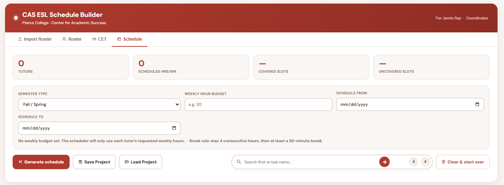
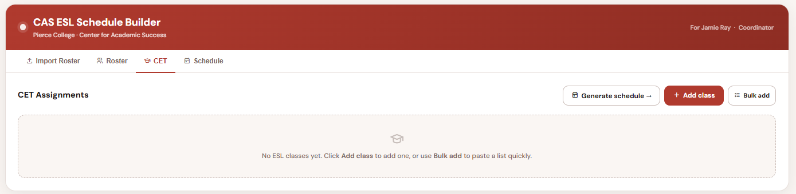
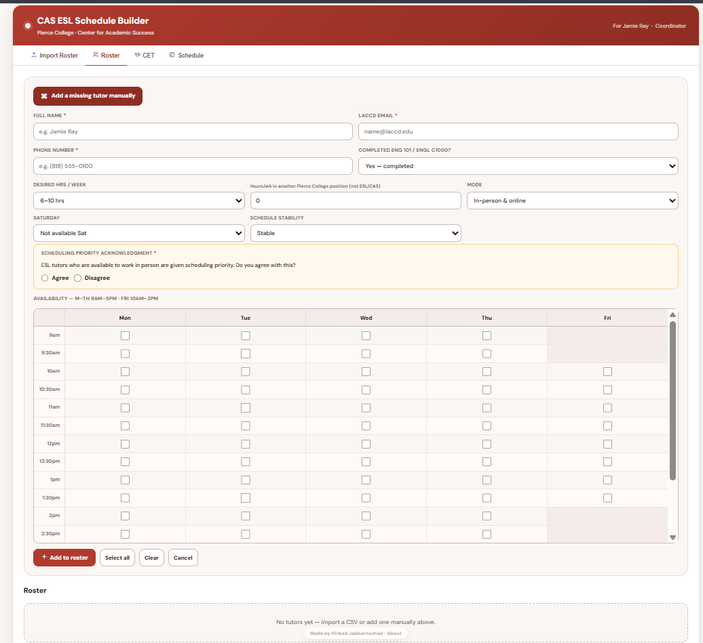
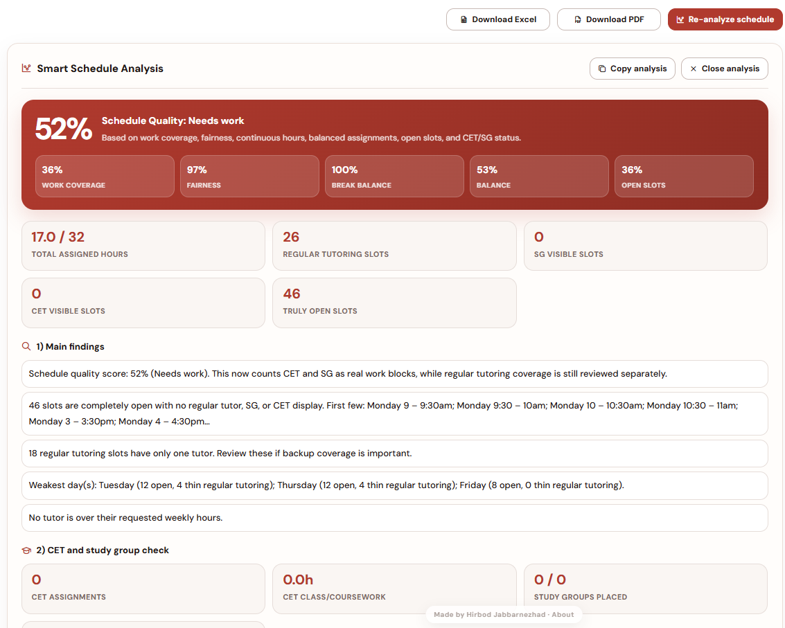

# CAS ESL Schedule Builder

A professional scheduling application developed for the **Center for Academic Success (CAS)** at **Los Angeles Pierce College** to automate and simplify ESL tutor scheduling.

The application generates optimized weekly tutoring schedules, manages Course Embedded Tutor (CET) assignments, automatically places Study Groups, balances tutor workloads, and provides coordinators with powerful scheduling and roster management tools.

> **Designed and developed by Hirbod Jabbarnezhad**

---

## Live Demo

**Application**
https://cas-esl-schedule-builder.netlify.app/

**GitHub Repository**
https://github.com/HirbodJb/Schedule-Maker

Current Version: **v2.1**

---

# Project Overview

The CAS ESL tutoring program schedules dozens of tutors every semester across multiple classes, tutoring modalities, Course Embedded Tutor (CET) assignments, and Study Groups.

Originally, this scheduling process was performed manually, requiring hours of coordinator work each semester.

CAS ESL Schedule Builder was developed to automate this workflow while still giving coordinators full manual control whenever adjustments are needed.

The application is designed around real scheduling rules used by the Pierce College Center for Academic Success.

---

# Key Features

## Smart Schedule Generation

Automatically generates weekly tutoring schedules while considering:

- Tutor availability
- Weekly requested hours
- In-person / Online preferences
- Schedule fairness
- Coverage optimization
- Operating hour restrictions
- Semester-specific rules

---

## Shift Compaction (v2.1)

A custom scheduling optimization algorithm designed to reduce fragmented tutor schedules.

Instead of assigning isolated half-hour blocks throughout the day, the scheduler prioritizes continuous work blocks whenever possible.

Benefits include:

- Fewer unnecessary campus gaps
- Reduced split shifts
- Better tutor experience
- More realistic work schedules
- Improved coordinator scheduling quality

---

## Course Embedded Tutor (CET) Management

Complete support for Course Embedded Tutors.

Features include:

- Multiple tutors per class
- Partial CET assignments
- Day-specific tutor assignments
- Saturday CET support
- Availability-aware tutor selection
- Automatic schedule integration
- Conflict prevention
- Visual CET blocks inside schedules

---

## Automatic Study Group Placement

Automatically places Study Groups while respecting scheduling constraints.

The scheduler:

- Places Study Groups before or after classes
- Never places a Study Group during class time
- Supports asynchronous tutoring workflows
- Allows manual adjustment when desired

---

## Semester Support

Supports multiple scheduling policies.

### Fall / Spring

- Monday–Thursday: 9:00 AM – 5:00 PM
- Friday: 10:00 AM – 2:00 PM

### Summer / Winter

- Monday–Thursday: 11:00 AM – 4:00 PM
- Friday closed automatically

---

## Tutor Roster Management

Manage tutor information including:

- CSV import from Google Forms
- Manual tutor creation
- Availability editor
- Weekly requested hours
- Scheduling preferences
- Contact information
- Search and filtering

---

## Interactive Schedule Editing

After generation, coordinators can:

- Manually move tutoring assignments
- Add additional tutoring blocks
- Undo regenerated schedules
- Search tutors instantly
- Highlight tutor schedules
- View uncovered time slots

---

## Analytics & Schedule Summary

Provides scheduling insights including:

- Tutor hour summaries
- Remaining available hours
- Uncovered tutoring slots
- Schedule quality overview
- Coverage statistics

---

## Export & Project Management

Supports exporting and saving schedules as:

- PDF
- Excel
- JSON project files

Projects can be saved and reopened at any time.

---

# Engineering Challenges Solved

This project required solving several real-world scheduling problems, including:

- Automatic schedule generation
- Fair tutor workload balancing
- Shift compaction to reduce fragmented schedules
- Course Embedded Tutor scheduling
- Automatic Study Group placement
- Semester-specific scheduling rules
- Availability matching
- Saturday scheduling support
- Conflict detection
- Interactive manual editing
- Coverage optimization

The scheduling engine has been continuously refined through multiple versions based on real coordinator feedback.

---

# Technologies Used

### Frontend

- HTML5
- CSS3
- Vanilla JavaScript

### Scheduling Engine

- Custom scheduling algorithm
- Availability matching
- Shift compaction optimization
- Conflict detection
- Constraint-based scheduling

### Export System

- jsPDF
- XLSX
- JSON serialization

### Deployment

- GitHub
- Netlify

---

# Screenshots

## Schedule Generation

## Course Embedded Tutor Management

## Weekly Schedule

## Analytics

---

# Version History

## v2.1

### Scheduling Improvements

- Introduced Shift Compaction algorithm
- Reduced fragmented tutor schedules
- Improved workload continuity
- Smarter tutor assignment selection

### Study Groups

- Improved automatic Study Group placement
- Prevented placement during active class sessions
- Improved scheduling validation

### General

- Better schedule quality
- Additional optimization improvements
- Bug fixes and performance improvements

---

## v2.0

Major feature release introducing:

- Complete Course Embedded Tutor system
- Automatic Study Group generation
- Asynchronous tutoring support
- CET visualization inside schedules
- Semester-specific scheduling
- Focus mode
- Availability-aware CET assignment
- Summer/Winter scheduling support
- Improved UI and workflow

---

## v1.0

Initial release featuring:

- Tutor roster management
- CSV import
- Automatic schedule generation
- Schedule editing
- PDF / Excel export
- Project save & load

---

# Why I Built This

As a Computer Science student and Course Embedded Tutor at Pierce College, I saw firsthand how much time coordinators spent manually creating tutoring schedules every semester.

This project began as a way to automate that process but evolved into a full scheduling platform capable of handling real operational constraints, improving schedule quality, and simplifying coordinator workflows.

Throughout development, the application has continuously evolved based on real usage, coordinator feedback, and additional scheduling requirements.

---

# Future Improvements

Potential future additions include:

- Multi-schedule support
- Multiple campus support
- Calendar integration
- Cloud save system
- Authentication
- Database support
- Advanced scheduling heuristics
- AI-assisted schedule optimization
- Mobile-friendly interface
- Usage analytics dashboard

---

# Author

**Hirbod Jabbarnezhad**

Computer Science Student — California State University, Northridge

GitHub:
https://github.com/HirbodJb

LinkedIn:
www.linkedin.com/in/hirbod-jabbarnezhad-424678334

---

# License

This project is licensed under the MIT License.

© 2026 Hirbod Jabbarnezhad